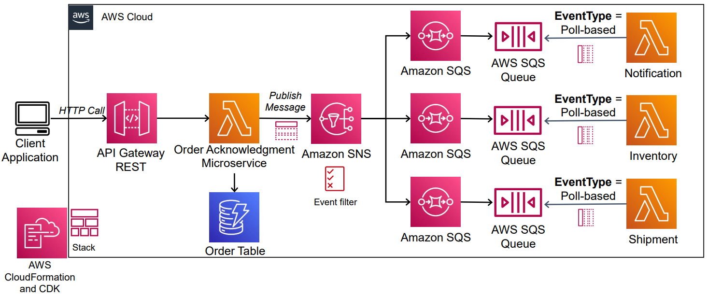

# Ebook Serverless Project

A collection of AWS serverless hands-on labs centered around an **ebook landing page** backed by fully serverless AWS services.



## Overview

This project demonstrates how to build and deploy a serverless ebook platform on AWS. Visitors fill out a form on the ebook landing page; the request is processed by AWS Lambda, stored in DynamoDB, and a confirmation is sent via SNS — all without managing any servers.

## Architecture

```
Browser (HTML/CSS/JS)
       │
       ▼
Amazon API Gateway  ──►  AWS Lambda  ──►  Amazon SNS  (email notification)
                                   │
                                   ▼
                            Amazon DynamoDB  (request storage)
```

## Project Structure

| Folder | Description |
|--------|-------------|
| [`Ebook/`](serverless-lab-26/Ebook/) | Ebook landing page (HTML/CSS/JS) with Lambda backends in Python, Node.js, and .NET 8 |
| [`ApiGW-Lamda-DynamoDB/`](serverless-lab-26/ApiGW-Lamda-DynamoDB/) | Lab: REST API Gateway → Lambda → DynamoDB CRUD operations |
| [`Serverless Website/`](serverless-lab-26/Serverless%20Website/) | Lab: Static website on S3 with a Lambda-backed contact form |
| [`S3-SNS-Lambda-ApiGW/`](serverless-lab-26/S3-SNS-Lambda-ApiGW/) | Lab: S3 event → SNS → Lambda → API Gateway pipeline |
| [`Libros-Python-SQS-DynamoDB-S3-Lambda-main/`](serverless-lab-26/Libros-Python-SQS-DynamoDB-S3-Lambda-main/) | Lab: Flask book-management app with DynamoDB Streams → SQS → Lambda → S3 → Athena |
| [`CV/`](serverless-lab-26/CV/) | Lab: CV/resume page with Lambda + API Gateway |

## Key AWS Services Used

- **Amazon API Gateway** — HTTP/REST endpoint for the ebook form
- **AWS Lambda** — Serverless compute (Python, Node.js, .NET 8)
- **Amazon DynamoDB** — NoSQL storage for form submissions
- **Amazon SNS** — Email notifications on new ebook requests
- **Amazon S3** — Static website hosting
- **Amazon SQS** — Message queue for event-driven pipelines
- **Amazon Athena** — Serverless query service for data analysis

## Quick Start — Ebook Landing Page

1. **Download the website assets**
   ```bash
   wget https://s3.eu-west-1.amazonaws.com/www.profesantos.cloud/Ebook_Serverless.zip
   unzip Ebook_Serverless.zip
   ```

2. **Deploy the Lambda function**  
   Use one of the runtime implementations under [`Ebook/`](serverless-lab-26/Ebook/):
   - `Python/lambda-sns.py` — Python 3.x
   - `NodeJS22/` — Node.js 22
   - `Net8/` — .NET 8

3. **Create an SNS topic** and update `SNS_TOPIC_ARN` in your Lambda function.

4. **Create an API Gateway** (REST, POST method) pointing to your Lambda function, then update the `ENDPOINT` constant in `Ebook/index.html`.

5. **Host the website** on S3 (static website hosting) or serve it locally.

## Labs

### API Gateway → Lambda → DynamoDB
Step-by-step guide to build a REST API backed by Lambda and DynamoDB.  
See [`ApiGW-Lamda-DynamoDB/README.md`](serverless-lab-26/ApiGW-Lamda-DynamoDB/README.md).

### Serverless Contact Form Website
Static website on S3 with a Lambda function that stores form submissions in DynamoDB.  
See [`Serverless Website/README.md`](serverless-lab-26/Serverless%20Website/README.md).

### Book Management (Flask + AWS Pipeline)
Flask app on EC2 → DynamoDB Streams → SQS → Lambda → S3 → Athena.  
See [`Libros-Python-SQS-DynamoDB-S3-Lambda-main/README.md`](serverless-lab-26/Libros-Python-SQS-DynamoDB-S3-Lambda-main/README.md).

## License

This project is licensed under the [MIT License](serverless-lab-26/Libros-Python-SQS-DynamoDB-S3-Lambda-main/LICENSE).
